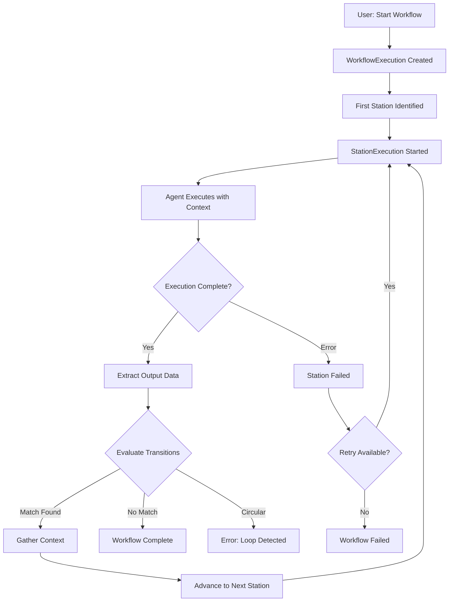
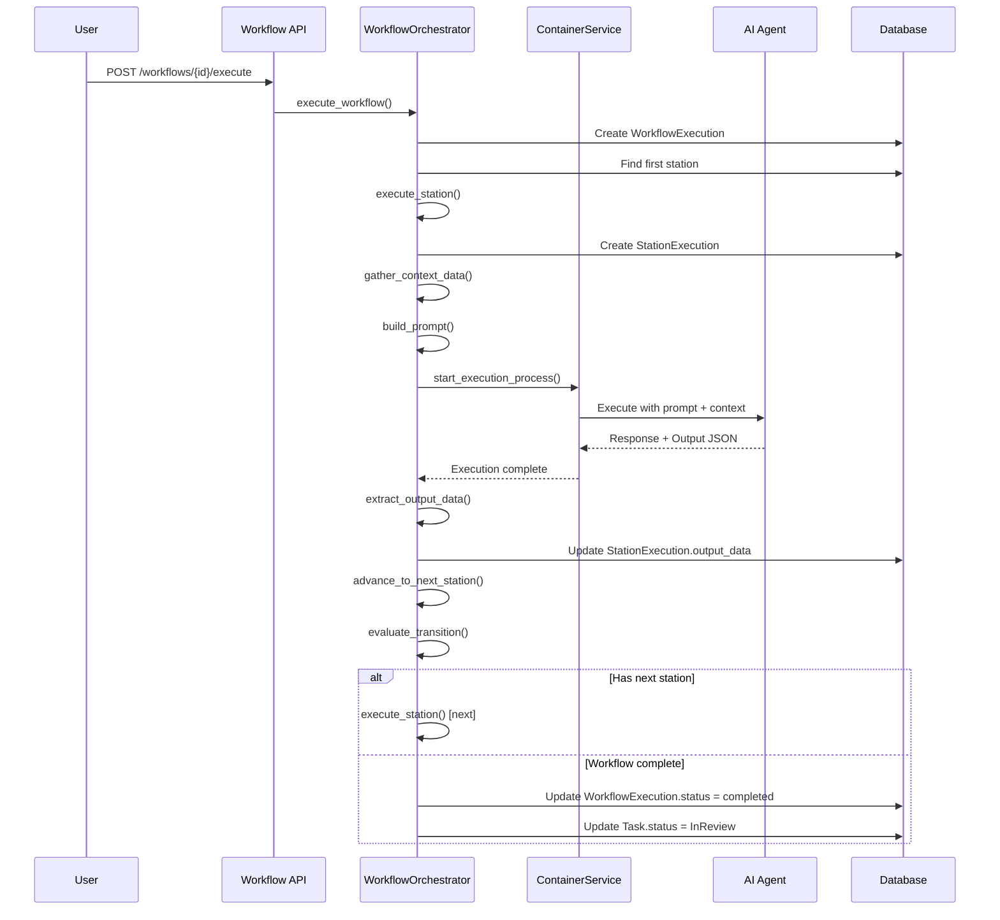
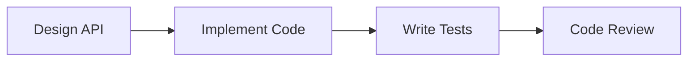
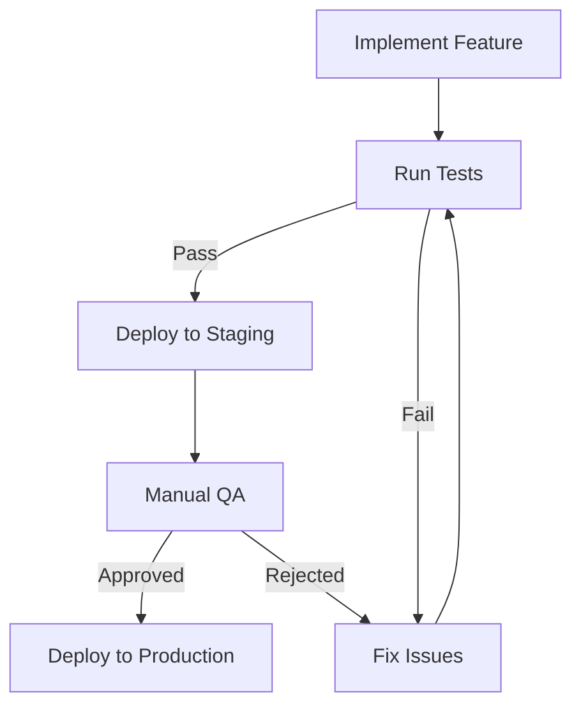
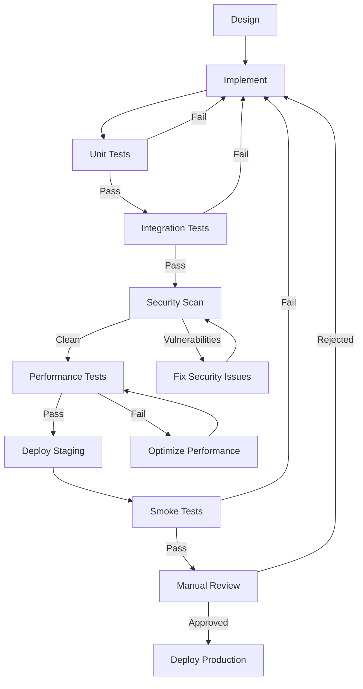
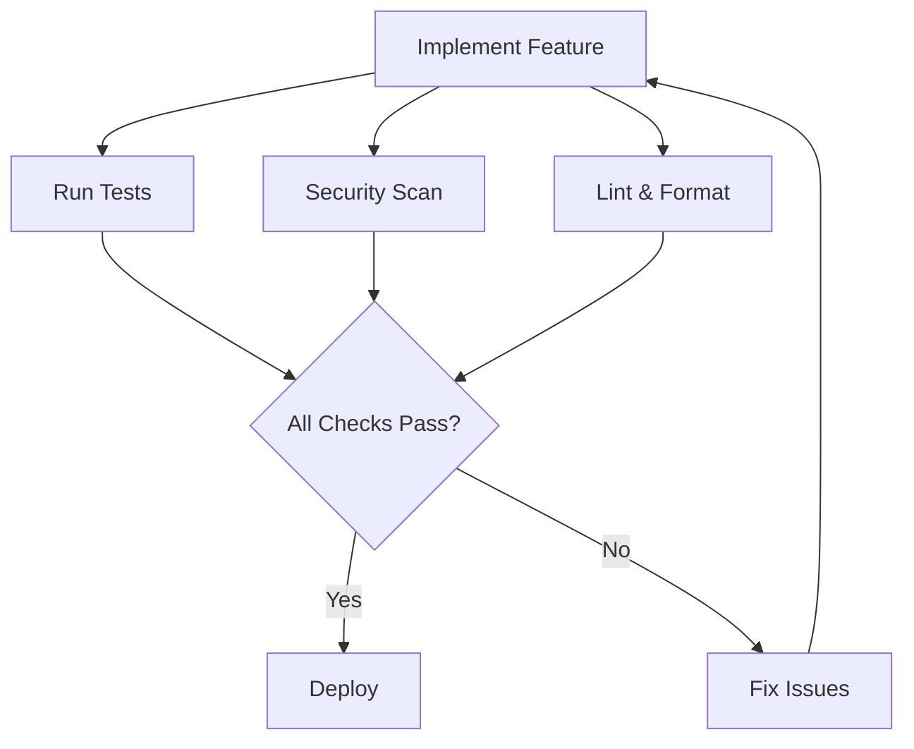

# Workflow Execution Feature Guide

## Table of Contents

1. [Overview](#overview)
2. [User Guide](#user-guide)
3. [Developer Guide](#developer-guide)
4. [Example Workflows](#example-workflows)
5. [Troubleshooting](#troubleshooting)

---

## Overview

The Workflow Execution feature enables automated, multi-stage AI agent pipelines for complex software development tasks. Instead of running a single agent action, you can define a sequence of stations (processing stages) with conditional transitions, allowing agents to collaborate through structured workflows.

### Key Concepts

- **Workflow**: A directed graph of stations and transitions
- **Station**: A processing stage with an assigned agent, prompt, and expected outputs
- **Transition**: A conditional rule determining the next station based on the current station's result
- **Execution**: A single run of a workflow on a specific task
- **Context**: Accumulated outputs from previous stations, passed to subsequent stations

### Architecture Diagram



---

## User Guide

### Creating a Workflow

#### 1. Navigate to the Factory Tab

The Factory tab displays all workflows in your project and provides a visual workflow editor.

#### 2. Click "Create Workflow"

This opens the workflow creation dialog where you can:
- **Name**: Give your workflow a descriptive name (e.g., "Feature Development Pipeline")
- **Description**: Explain the workflow's purpose

#### 3. Design Your Workflow

The workflow editor uses a node-based visual interface:

- **Adding Stations**:
  1. Click "Add Station" in the toolbar
  2. Position the station node on the canvas
  3. Click the station to configure it

- **Configuring Stations**:
  - **Name**: Short label (e.g., "Design", "Implementation", "Code Review")
  - **Agent**: Select the AI agent to execute this station
  - **Prompt**: Instructions for the agent at this stage
  - **Output Context Keys**: JSON keys the agent should provide (e.g., `["design_doc", "api_spec"]`)
  - **Position**: Determines execution order (lower numbers execute first)

- **Adding Transitions**:
  1. Drag from the output handle of one station
  2. Drop on the input handle of another station
  3. Click the transition edge to configure conditions

- **Configuring Transitions**:
  - **Condition Type**:
    - `always` / `unconditional` - Always transition (default)
    - `success` - Only if the station completed successfully
    - `failure` - Only if the station failed
    - `conditional` - Custom condition based on output data
  - **Condition Value**: JSON expression for conditional transitions

#### 4. Save Your Workflow

Click "Save Workflow" to persist your configuration.

### Starting a Workflow Execution

#### Option 1: From Task Card

1. Open a task card
2. Click "Start Workflow" button
3. Select the workflow from the dropdown
4. Choose executor profile (optional)
5. Specify base branch (defaults to task's branch)
6. Click "Start"

#### Option 2: Via API

```bash
curl -X POST http://localhost:3501/api/workflows/{workflow_id}/execute \
  -H "Content-Type: application/json" \
  -d '{
    "task_id": "uuid-of-task",
    "base_branch": "main",
    "executor_profile_id": "optional-executor-id"
  }'
```

Response:
```json
{
  "workflow_execution_id": "uuid",
  "task_attempt_id": "uuid",
  "current_station_id": "uuid",
  "status": "running"
}
```

### Monitoring Execution Progress

#### Real-Time Station Status

Task cards display the current station status:

- **Station Name**: Currently executing station
- **Status Indicators**:
  - 🔄 **Running**: Station is actively executing
  - ✅ **Completed**: Station finished successfully
  - ❌ **Failed**: Station encountered an error
  - ⏸️ **Pending**: Waiting to start

#### Execution Logs

Stream logs from the active station:

1. Click the task card
2. View the "Execution Logs" panel
3. Logs stream in real-time from the agent's execution process

#### Context Accumulation

Each station's outputs are visible in the "Context" panel:

```json
{
  "design_doc": "Markdown document describing the feature...",
  "api_spec": "OpenAPI specification for endpoints...",
  "test_results": {"passed": 45, "failed": 2},
  "review_status": "approved"
}
```

### Managing Workflow Executions

#### Canceling a Workflow

```bash
POST /api/workflow-executions/{execution_id}/cancel
```

This gracefully stops the current station and marks the workflow as canceled.

#### Retrying a Failed Station

If a station fails, you can retry it without restarting the entire workflow:

```bash
POST /api/workflow-executions/{execution_id}/retry-station
```

This:
1. Creates a new `StationExecution` record (preserves the failed attempt for audit)
2. Gathers context from previously completed stations
3. Restarts execution from the failed station

#### Resuming a Crashed Workflow

If the execution process crashes (e.g., server restart), the workflow can resume:

```bash
POST /api/workflow-executions/{execution_id}/resume
```

The system uses checkpoints (`current_station_id`) to resume from the last known state.

### Setting Up Conditional Transitions

Conditional transitions enable branching logic based on agent outputs.

#### Example: Test-Based Branching

**Station: "Run Tests"**
- Agent: Test Runner
- Output Context Keys: `["test_results"]`
- Agent outputs:
  ```json
  {
    "test_results": {
      "passed": 45,
      "failed": 2,
      "status": "failure"
    }
  }
  ```

**Transition 1: Tests Pass → Deploy**
- Condition Type: `conditional`
- Condition Value: `{"key": "test_results.status", "value": "success"}`

**Transition 2: Tests Fail → Fix Issues**
- Condition Type: `conditional`
- Condition Value: `{"key": "test_results.status", "value": "failure"}`

#### Example: Approval-Based Branching

**Station: "Code Review"**
- Agent: Review Agent
- Output Context Keys: `["review_approved"]`
- Agent outputs:
  ```json
  {
    "review_approved": true,
    "comments": "Looks good!"
  }
  ```

**Transition 1: Approved → Merge**
- Condition Type: `conditional`
- Condition Value: `{"key": "review_approved", "value": true}`

**Transition 2: Rejected → Revise**
- Condition Type: `conditional`
- Condition Value: `{"key": "review_approved", "value": false}`

#### Condition Evaluation Rules

1. **Unconditional**: Always transitions (useful for linear workflows)
2. **Success**: Only transitions if `station_execution.status == "completed"`
3. **Failure**: Only transitions if `station_execution.status == "failed"`
4. **Conditional**:
   - Simple key check: `"output_key"` - Returns true if key exists in output_data
   - Key-value check: `{"key": "output_key", "value": expected_value}` - Returns true if values match
   - Nested keys: `{"key": "nested.path.key", "value": ...}` - Supports dot notation

**Important**: The first matching transition (in database order) is selected. Ensure conditions are mutually exclusive or carefully ordered.

### Workflow Design Best Practices

1. **Start Simple**: Begin with linear workflows, add branching later
2. **Clear Station Names**: Use descriptive names ("Design API" not "Station 1")
3. **Specific Prompts**: Provide detailed instructions for each station
4. **Define Outputs Early**: Plan output_context_keys before creating stations
5. **Avoid Loops**: The system detects circular workflows and will error
6. **Test Incrementally**: Run single-station workflows before adding transitions
7. **Handle Failures**: Always have a transition for the `failure` condition
8. **Document Context Keys**: Comment the expected JSON structure for each station

---

## Developer Guide

### Architecture Overview

#### Data Flow Diagram



### Database Schema

#### Core Tables

**`workflow_stations`**
```sql
CREATE TABLE workflow_stations (
    id TEXT PRIMARY KEY,
    workflow_id TEXT NOT NULL,
    name TEXT NOT NULL,
    agent_id TEXT NOT NULL,
    station_prompt TEXT NOT NULL,
    output_context_keys TEXT,  -- JSON array: ["key1", "key2"]
    position INTEGER NOT NULL,
    created_at TEXT NOT NULL,
    updated_at TEXT NOT NULL,
    FOREIGN KEY (workflow_id) REFERENCES workflows(id) ON DELETE CASCADE,
    FOREIGN KEY (agent_id) REFERENCES agents(id)
)
```

**`station_transitions`**
```sql
CREATE TABLE station_transitions (
    id TEXT PRIMARY KEY,
    workflow_id TEXT NOT NULL,
    from_station_id TEXT NOT NULL,
    to_station_id TEXT NOT NULL,
    condition_type TEXT NOT NULL,  -- "always", "success", "failure", "conditional"
    condition_value TEXT,  -- JSON for conditional types
    created_at TEXT NOT NULL,
    FOREIGN KEY (workflow_id) REFERENCES workflows(id) ON DELETE CASCADE,
    FOREIGN KEY (from_station_id) REFERENCES workflow_stations(id) ON DELETE CASCADE,
    FOREIGN KEY (to_station_id) REFERENCES workflow_stations(id) ON DELETE CASCADE
)
```

**`workflow_executions`**
```sql
CREATE TABLE workflow_executions (
    id TEXT PRIMARY KEY,
    workflow_id TEXT NOT NULL,
    task_id TEXT NOT NULL,
    task_attempt_id TEXT NOT NULL,
    status TEXT NOT NULL,  -- "pending", "running", "completed", "failed", "canceled"
    current_station_id TEXT,  -- Checkpoint for resumption
    started_at TEXT,
    completed_at TEXT,
    error_message TEXT,
    created_at TEXT NOT NULL,
    updated_at TEXT NOT NULL,
    FOREIGN KEY (workflow_id) REFERENCES workflows(id),
    FOREIGN KEY (task_id) REFERENCES tasks(id),
    FOREIGN KEY (task_attempt_id) REFERENCES task_attempts(id),
    FOREIGN KEY (current_station_id) REFERENCES workflow_stations(id)
)
```

**`station_executions`**
```sql
CREATE TABLE station_executions (
    id TEXT PRIMARY KEY,
    workflow_execution_id TEXT NOT NULL,
    station_id TEXT NOT NULL,
    execution_process_id TEXT,  -- Links to process logs
    status TEXT NOT NULL,  -- "pending", "running", "completed", "failed"
    output_data TEXT,  -- JSON outputs matching output_context_keys
    started_at TEXT,
    completed_at TEXT,
    error_message TEXT,
    created_at TEXT NOT NULL,
    updated_at TEXT NOT NULL,
    FOREIGN KEY (workflow_execution_id) REFERENCES workflow_executions(id) ON DELETE CASCADE,
    FOREIGN KEY (station_id) REFERENCES workflow_stations(id),
    FOREIGN KEY (execution_process_id) REFERENCES execution_processes(id)
)
```

**`station_context`** (Legacy - deprecated in favor of station_executions.output_data)
```sql
CREATE TABLE station_context (
    id TEXT PRIMARY KEY,
    task_id TEXT NOT NULL,
    station_id TEXT NOT NULL,
    context_key TEXT NOT NULL,
    context_value TEXT NOT NULL,
    created_at TEXT NOT NULL,
    FOREIGN KEY (task_id) REFERENCES tasks(id) ON DELETE CASCADE,
    FOREIGN KEY (station_id) REFERENCES workflow_stations(id) ON DELETE CASCADE,
    UNIQUE(task_id, station_id, context_key)
)
```

#### Relationships

```
workflows (1) ---> (N) workflow_stations
workflows (1) ---> (N) station_transitions
workflows (1) ---> (N) workflow_executions

workflow_stations (1) ---> (N) station_executions
workflow_executions (1) ---> (N) station_executions

station_executions (1) ---> (1) execution_processes (for logs)
workflow_executions (1) ---> (1) task_attempts (shared git branch)
```

### API Endpoint Reference

#### Workflow CRUD

**List Workflows**
```http
GET /api/projects/{project_id}/workflows
```

Response:
```json
[
  {
    "id": "uuid",
    "project_id": "uuid",
    "name": "Feature Development Pipeline",
    "description": "Design → Code → Review → Deploy",
    "created_at": "2025-11-07T12:00:00Z",
    "updated_at": "2025-11-07T12:00:00Z"
  }
]
```

**Create Workflow**
```http
POST /api/projects/{project_id}/workflows
Content-Type: application/json

{
  "name": "Feature Development Pipeline",
  "description": "Automated feature development workflow"
}
```

**Update Workflow**
```http
PUT /api/workflows/{workflow_id}
Content-Type: application/json

{
  "name": "Updated Name",
  "description": "Updated description"
}
```

**Delete Workflow**
```http
DELETE /api/workflows/{workflow_id}
```

#### Station Management

**List Stations**
```http
GET /api/workflows/{workflow_id}/stations
```

**Create Station**
```http
POST /api/workflows/{workflow_id}/stations
Content-Type: application/json

{
  "name": "Design API",
  "agent_id": "uuid-of-agent",
  "station_prompt": "Design a REST API for the feature. Include OpenAPI spec.",
  "output_context_keys": ["design_doc", "api_spec"],
  "position": 1
}
```

**Update Station**
```http
PUT /api/stations/{station_id}
Content-Type: application/json

{
  "name": "Updated Station Name",
  "station_prompt": "Updated prompt...",
  "output_context_keys": ["key1", "key2"]
}
```

#### Transition Management

**List Transitions**
```http
GET /api/workflows/{workflow_id}/transitions
```

**Create Transition**
```http
POST /api/workflows/{workflow_id}/transitions
Content-Type: application/json

{
  "from_station_id": "uuid",
  "to_station_id": "uuid",
  "condition_type": "conditional",
  "condition_value": "{\"key\": \"test_results.status\", \"value\": \"success\"}"
}
```

#### Workflow Execution

**Start Execution**
```http
POST /api/workflows/{workflow_id}/execute
Content-Type: application/json

{
  "task_id": "uuid",
  "base_branch": "main",
  "executor_profile_id": "uuid"  // optional
}
```

Response:
```json
{
  "workflow_execution_id": "uuid",
  "task_attempt_id": "uuid",
  "current_station_id": "uuid",
  "status": "running"
}
```

**Get Execution Status**
```http
GET /api/workflow-executions/{execution_id}
```

Response:
```json
{
  "id": "uuid",
  "workflow_id": "uuid",
  "task_id": "uuid",
  "task_attempt_id": "uuid",
  "status": "running",
  "current_station_id": "uuid",
  "current_station": {
    "id": "uuid",
    "name": "Code Implementation",
    "agent_id": "uuid"
  },
  "started_at": "2025-11-07T12:00:00Z",
  "completed_at": null,
  "error_message": null
}
```

**List Station Executions**
```http
GET /api/workflow-executions/{execution_id}/stations
```

Response:
```json
[
  {
    "id": "uuid",
    "station_id": "uuid",
    "station_name": "Design API",
    "status": "completed",
    "output_data": {
      "design_doc": "...",
      "api_spec": "..."
    },
    "started_at": "2025-11-07T12:00:00Z",
    "completed_at": "2025-11-07T12:05:00Z"
  },
  {
    "id": "uuid",
    "station_id": "uuid",
    "station_name": "Code Implementation",
    "status": "running",
    "output_data": null,
    "started_at": "2025-11-07T12:05:00Z",
    "completed_at": null
  }
]
```

**Cancel Execution**
```http
POST /api/workflow-executions/{execution_id}/cancel
```

**Retry Failed Station**
```http
POST /api/workflow-executions/{execution_id}/retry-station
```

**Resume Crashed Execution**
```http
POST /api/workflow-executions/{execution_id}/resume
```

### Service Layer: WorkflowOrchestrator

File: `crates/services/src/services/workflow_orchestrator.rs`

#### Key Methods

**`execute_station()`**

Starts execution of a single station.

```rust
pub async fn execute_station(
    &self,
    workflow_execution_id: &str,
    station_id: &str,
    context_data: &serde_json::Value,
) -> Result<String, WorkflowOrchestratorError>
```

**Steps:**
1. Fetch station and agent from database
2. Create `StationExecution` record with status "pending"
3. Build prompt: `agent.system_prompt + "\n\n" + station.station_prompt + "\n\n## Previous Outputs:\n" + context_data`
4. Determine if this is initial or follow-up request
5. Create `ExecutionProcess` via `ContainerService`
6. Update `StationExecution.execution_process_id`
7. Update `WorkflowExecution.current_station_id` (checkpoint)
8. Return `station_execution_id`

**`advance_to_next_station()`**

Determines the next station after current station completes.

```rust
pub async fn advance_to_next_station(
    &self,
    workflow_execution_id: &str,
    current_station_id: &str,
    current_station_status: &str,
    output_data: &serde_json::Value,
    visited_stations: &mut std::collections::HashSet<String>,
) -> Result<Option<String>, WorkflowOrchestratorError>
```

**Steps:**
1. Fetch all transitions from `current_station_id`
2. For each transition (in database order):
   - Call `evaluate_transition()`
   - If true, return `to_station_id`
3. Before returning, check if `to_station_id` is in `visited_stations`
   - If yes, return `CircularWorkflow` error
   - If no, add to `visited_stations` and return
4. If no transitions match, return `None` (workflow complete)

**`evaluate_transition()`**

Evaluates a single transition's condition.

```rust
fn evaluate_transition(
    condition_type: &str,
    condition_value: Option<&str>,
    station_status: &str,
    output_data: &serde_json::Value,
) -> Result<bool, WorkflowOrchestratorError>
```

**Logic:**
```rust
match condition_type {
    "always" | "unconditional" => true,
    "success" => station_status == "completed",
    "failure" => station_status == "failed",
    "conditional" => {
        let condition = parse_json(condition_value)?;
        if condition.is_string() {
            // Simple key check: "output_key"
            let key = condition.as_str();
            output_data.get(key).is_some()
        } else if condition.is_object() {
            // Key-value check: {"key": "path", "value": expected}
            let key = condition["key"].as_str();
            let expected = &condition["value"];
            let actual = output_data.pointer(key);  // Supports "nested.path.key"
            actual == Some(expected)
        } else {
            Err(InvalidConditionFormat)
        }
    }
    _ => Err(UnknownConditionType)
}
```

**`gather_context_data()`**

Merges outputs from all completed stations.

```rust
pub async fn gather_context_data(
    &self,
    workflow_execution_id: &str,
) -> Result<serde_json::Value, WorkflowOrchestratorError>
```

**Steps:**
1. Fetch all `station_executions` for the workflow execution with status "completed"
2. For each execution:
   - Parse `output_data` JSON
   - Merge into accumulated context
   - Later stations overwrite earlier ones (intentional for refinement)
3. Return merged JSON object

**`handle_station_completion()`**

Called when a station finishes (success or failure).

```rust
pub async fn handle_station_completion(
    &self,
    station_execution_id: &str,
    status: &str,
    output_data: Option<&serde_json::Value>,
    error_message: Option<&str>,
) -> Result<(), WorkflowOrchestratorError>
```

**Steps:**
1. Update `StationExecution` with status, output_data, completed_at, error_message
2. Gather updated context via `gather_context_data()`
3. Call `advance_to_next_station()`
4. If next station exists:
   - Call `execute_station()` for next station with context
5. If no next station (workflow complete):
   - Update `WorkflowExecution.status = "completed"`
   - Update `Task.status = "InReview"`
6. If circular workflow detected:
   - Update `WorkflowExecution.status = "failed"`
   - Set error_message

**`retry_station_execution()`**

Retries a failed station without restarting the workflow.

```rust
pub async fn retry_station_execution(
    &self,
    workflow_execution_id: &str,
) -> Result<String, WorkflowOrchestratorError>
```

**Steps:**
1. Fetch current `WorkflowExecution` and current station
2. Verify station status is "failed"
3. Create new `StationExecution` record (preserves old for audit)
4. Gather context from previously completed stations
5. Call `execute_station()` with context
6. Return new `station_execution_id`

### Error Handling Patterns

#### Error Types

```rust
pub enum WorkflowOrchestratorError {
    DatabaseError(sqlx::Error),
    WorkflowNotFound(String),
    StationNotFound(String),
    AgentNotFound(String),
    NoStations,
    NoTransitions,
    NoValidTransition,
    CircularWorkflow,
    InvalidConditionFormat,
    UnknownConditionType,
    OutputDataParseError,
    ExecutionProcessError(String),
    InvalidStateTransition,
}
```

#### ErrorContext for Structured Logging

```rust
pub struct ErrorContext {
    pub station_id: Option<String>,
    pub station_execution_id: Option<String>,
    pub workflow_execution_id: Option<String>,
    pub execution_process_id: Option<String>,
}

impl ErrorContext {
    pub fn log_error(&self, error: &WorkflowOrchestratorError) {
        tracing::error!(
            station_id = ?self.station_id,
            station_execution_id = ?self.station_execution_id,
            workflow_execution_id = ?self.workflow_execution_id,
            execution_process_id = ?self.execution_process_id,
            error = ?error,
            "Workflow orchestrator error"
        );
    }
}
```

Usage:
```rust
let ctx = ErrorContext {
    workflow_execution_id: Some(execution_id.to_string()),
    station_id: Some(station_id.to_string()),
    ..Default::default()
};

if let Err(e) = self.execute_station(...).await {
    ctx.log_error(&e);
    return Err(e);
}
```

### Adding New Condition Types

To add a new condition type (e.g., `"regex_match"`):

1. **Update `evaluate_transition()` in `workflow_orchestrator.rs`:**

```rust
match condition_type {
    // ... existing conditions ...
    "regex_match" => {
        let condition = parse_json(condition_value)?;
        let pattern = condition["pattern"].as_str()
            .ok_or(InvalidConditionFormat)?;
        let key = condition["key"].as_str()
            .ok_or(InvalidConditionFormat)?;

        let value = output_data.pointer(key)
            .and_then(|v| v.as_str())
            .ok_or(InvalidConditionFormat)?;

        let re = regex::Regex::new(pattern)
            .map_err(|_| InvalidConditionFormat)?;

        re.is_match(value)
    }
    _ => Err(UnknownConditionType)
}
```

2. **Update TypeScript types in `shared/types.ts`:**

```typescript
export type ConditionType =
  | "always"
  | "unconditional"
  | "success"
  | "failure"
  | "conditional"
  | "regex_match";  // Add new type
```

3. **Update frontend transition editor:**

Add the new condition type to the dropdown in `TransitionConfigDialog.tsx`:

```typescript
const conditionTypes = [
  { value: "always", label: "Always" },
  { value: "success", label: "On Success" },
  { value: "failure", label: "On Failure" },
  { value: "conditional", label: "Conditional" },
  { value: "regex_match", label: "Regex Match" },  // Add here
];
```

4. **Add condition editor UI:**

```typescript
{conditionType === "regex_match" && (
  <div className="space-y-2">
    <Label>Output Key</Label>
    <Input
      placeholder="e.g., test_results.summary"
      value={conditionKey}
      onChange={(e) => setConditionKey(e.target.value)}
    />
    <Label>Regex Pattern</Label>
    <Input
      placeholder="e.g., ^PASSED: .*"
      value={conditionPattern}
      onChange={(e) => setConditionPattern(e.target.value)}
    />
  </div>
)}
```

5. **Update documentation** with examples of the new condition type.

### Output Data Extraction

#### Current Implementation (Phase 1.1)

Agents are instructed to output JSON matching the station's `output_context_keys`.

**Prompt Template:**
```
{agent.system_prompt}

{station.station_prompt}

## Previous Outputs
{json_serialized_context}

## Expected Outputs
Please provide the following outputs in a JSON code block:
{list_of_output_context_keys}

Example format:
```json
{
  "key1": "value1",
  "key2": "value2"
}
```
```

**Extraction Logic:**

File: `crates/services/src/services/workflow_orchestrator.rs`

```rust
fn extract_output_data(
    response: &str,
    output_context_keys: &[String],
) -> Result<serde_json::Value, WorkflowOrchestratorError> {
    // Find ```json ... ``` blocks
    let json_pattern = regex::Regex::new(r"```json\s*\n(.*?)\n```")
        .map_err(|_| OutputDataParseError)?;

    for capture in json_pattern.captures_iter(response) {
        let json_str = &capture[1];
        let parsed: serde_json::Value = serde_json::from_str(json_str)
            .map_err(|_| OutputDataParseError)?;

        // Filter to only requested keys
        let mut filtered = serde_json::Map::new();
        for key in output_context_keys {
            if let Some(value) = parsed.get(key) {
                filtered.insert(key.clone(), value.clone());
            }
        }

        return Ok(serde_json::Value::Object(filtered));
    }

    // No JSON block found
    Ok(serde_json::Value::Object(serde_json::Map::new()))
}
```

#### Future Enhancement: Structured Output

For more reliable extraction, consider using structured output APIs:

**Claude (Anthropic):**
```json
{
  "response_format": {
    "type": "json_schema",
    "json_schema": {
      "name": "station_output",
      "schema": {
        "type": "object",
        "properties": {
          "design_doc": { "type": "string" },
          "api_spec": { "type": "string" }
        },
        "required": ["design_doc", "api_spec"]
      }
    }
  }
}
```

**OpenAI:**
```json
{
  "response_format": {
    "type": "json_schema",
    "json_schema": { ... }
  }
}
```

This would require updating `ContainerService` to pass schema based on `output_context_keys`.

### Testing Strategy

#### Unit Tests

Test individual components in isolation:

```rust
#[cfg(test)]
mod tests {
    use super::*;

    #[test]
    fn test_evaluate_transition_unconditional() {
        let result = evaluate_transition(
            "always",
            None,
            "completed",
            &serde_json::json!({}),
        );
        assert_eq!(result.unwrap(), true);
    }

    #[test]
    fn test_evaluate_transition_success() {
        let result = evaluate_transition(
            "success",
            None,
            "completed",
            &serde_json::json!({}),
        );
        assert_eq!(result.unwrap(), true);

        let result = evaluate_transition(
            "success",
            None,
            "failed",
            &serde_json::json!({}),
        );
        assert_eq!(result.unwrap(), false);
    }

    #[test]
    fn test_evaluate_transition_conditional_key_exists() {
        let result = evaluate_transition(
            "conditional",
            Some("\"review_approved\""),
            "completed",
            &serde_json::json!({"review_approved": true}),
        );
        assert_eq!(result.unwrap(), true);
    }

    #[test]
    fn test_evaluate_transition_conditional_key_value() {
        let result = evaluate_transition(
            "conditional",
            Some(r#"{"key": "status", "value": "approved"}"#),
            "completed",
            &serde_json::json!({"status": "approved"}),
        );
        assert_eq!(result.unwrap(), true);
    }
}
```

#### Integration Tests

Test full workflow execution:

```rust
#[tokio::test]
async fn test_workflow_execution_linear() {
    let db = setup_test_db().await;
    let orchestrator = WorkflowOrchestrator::new(db.clone());

    // Create workflow, stations, transitions
    let workflow_id = create_test_workflow(&db).await;
    let station1_id = create_station(&db, workflow_id, "Design", 1).await;
    let station2_id = create_station(&db, workflow_id, "Code", 2).await;
    create_transition(&db, station1_id, station2_id, "always", None).await;

    // Start execution
    let execution_id = orchestrator.execute_workflow(workflow_id, task_id).await.unwrap();

    // Simulate station 1 completion
    orchestrator.handle_station_completion(
        &station1_execution_id,
        "completed",
        Some(&serde_json::json!({"design_doc": "..."})),
        None,
    ).await.unwrap();

    // Verify station 2 started
    let execution = get_workflow_execution(&db, &execution_id).await;
    assert_eq!(execution.current_station_id, Some(station2_id));
}
```

#### Frontend Tests

Test React components:

```typescript
import { render, screen, fireEvent } from '@testing-library/react';
import { StationNode } from './StationNode';

test('renders station node with status', () => {
  const station = {
    id: '1',
    name: 'Design API',
    agent_id: '2',
    status: 'running',
  };

  render(<StationNode data={station} />);

  expect(screen.getByText('Design API')).toBeInTheDocument();
  expect(screen.getByText('🔄')).toBeInTheDocument();  // Running spinner
});

test('transitions display correct colors', () => {
  const transition = {
    id: '1',
    condition_type: 'success',
  };

  const { container } = render(<TransitionEdge data={transition} />);
  const edge = container.querySelector('.react-flow__edge-path');

  expect(edge).toHaveStyle({ stroke: 'green' });
});
```

---

## Example Workflows

### 1. Simple Linear Workflow

**Use Case**: Feature development with sequential stages



**Configuration:**

**Stations:**

| Position | Name | Agent | Prompt | Output Keys |
|----------|------|-------|--------|-------------|
| 1 | Design API | Design Agent | "Design a REST API for this feature. Include OpenAPI spec." | `["design_doc", "api_spec"]` |
| 2 | Implement Code | Code Agent | "Implement the API based on the design. Use the provided OpenAPI spec." | `["code_files"]` |
| 3 | Write Tests | Test Agent | "Write integration tests for the implemented endpoints." | `["test_files"]` |
| 4 | Code Review | Review Agent | "Review the code and tests. Check for best practices." | `["review_comments"]` |

**Transitions:**

| From | To | Condition |
|------|-----|-----------|
| Design API | Implement Code | `always` |
| Implement Code | Write Tests | `always` |
| Write Tests | Code Review | `always` |

**Context Flow:**

```json
// After Design API
{
  "design_doc": "Markdown document...",
  "api_spec": "OpenAPI JSON..."
}

// After Implement Code
{
  "design_doc": "...",
  "api_spec": "...",
  "code_files": ["src/api/users.rs", "src/api/auth.rs"]
}

// After Write Tests
{
  "design_doc": "...",
  "api_spec": "...",
  "code_files": [...],
  "test_files": ["tests/api_tests.rs"]
}

// After Code Review
{
  "design_doc": "...",
  "api_spec": "...",
  "code_files": [...],
  "test_files": [...],
  "review_comments": "Looks good! Minor suggestions: ..."
}
```

### 2. Conditional Workflow (Test-Based)

**Use Case**: Automated testing with conditional deployment



**Configuration:**

**Stations:**

| Position | Name | Agent | Output Keys |
|----------|------|-------|-------------|
| 1 | Implement Feature | Code Agent | `["code_files"]` |
| 2 | Run Tests | Test Agent | `["test_results"]` |
| 3 | Fix Issues | Code Agent | `["fixed_files"]` |
| 4 | Deploy to Staging | Deploy Agent | `["staging_url"]` |
| 5 | Manual QA | QA Agent | `["qa_approved"]` |
| 6 | Deploy to Production | Deploy Agent | `["production_url"]` |

**Transitions:**

| From | To | Condition Type | Condition Value |
|------|-----|----------------|-----------------|
| Implement Feature | Run Tests | `always` | - |
| Run Tests | Deploy to Staging | `conditional` | `{"key": "test_results.status", "value": "passed"}` |
| Run Tests | Fix Issues | `conditional` | `{"key": "test_results.status", "value": "failed"}` |
| Fix Issues | Run Tests | `always` | - |
| Deploy to Staging | Manual QA | `always` | - |
| Manual QA | Deploy to Production | `conditional` | `{"key": "qa_approved", "value": true}` |
| Manual QA | Fix Issues | `conditional` | `{"key": "qa_approved", "value": false}` |

**Output Examples:**

```json
// Run Tests (Pass)
{
  "test_results": {
    "status": "passed",
    "total": 47,
    "passed": 47,
    "failed": 0
  }
}

// Run Tests (Fail)
{
  "test_results": {
    "status": "failed",
    "total": 47,
    "passed": 45,
    "failed": 2,
    "failures": [
      "test_user_authentication",
      "test_password_reset"
    ]
  }
}

// Manual QA (Approved)
{
  "qa_approved": true,
  "qa_notes": "All functionality works as expected."
}

// Manual QA (Rejected)
{
  "qa_approved": false,
  "qa_notes": "Found UI bug in password reset flow."
}
```

### 3. Complex Multi-Stage Pipeline

**Use Case**: Full software release pipeline with multiple validation gates



**Configuration:**

**Stations:**

| Position | Name | Agent | Output Keys |
|----------|------|-------|-------------|
| 1 | Design | Design Agent | `["architecture_doc", "api_spec"]` |
| 2 | Implement | Code Agent | `["code_files", "implementation_notes"]` |
| 3 | Unit Tests | Test Agent | `["unit_test_results"]` |
| 4 | Integration Tests | Test Agent | `["integration_test_results"]` |
| 5 | Security Scan | Security Agent | `["security_scan_results"]` |
| 6 | Fix Security Issues | Code Agent | `["security_fixes"]` |
| 7 | Performance Tests | Performance Agent | `["performance_results"]` |
| 8 | Optimize Performance | Code Agent | `["optimizations"]` |
| 9 | Deploy Staging | Deploy Agent | `["staging_url"]` |
| 10 | Smoke Tests | Test Agent | `["smoke_test_results"]` |
| 11 | Manual Review | Review Agent | `["review_approved", "review_notes"]` |
| 12 | Deploy Production | Deploy Agent | `["production_url"]` |

**Transitions (Selective):**

| From | To | Condition Type | Condition Value |
|------|-----|----------------|-----------------|
| Design | Implement | `always` | - |
| Implement | Unit Tests | `always` | - |
| Unit Tests | Integration Tests | `conditional` | `{"key": "unit_test_results.status", "value": "passed"}` |
| Unit Tests | Implement | `conditional` | `{"key": "unit_test_results.status", "value": "failed"}` |
| Integration Tests | Security Scan | `conditional` | `{"key": "integration_test_results.status", "value": "passed"}` |
| Integration Tests | Implement | `conditional` | `{"key": "integration_test_results.status", "value": "failed"}` |
| Security Scan | Performance Tests | `conditional` | `{"key": "security_scan_results.vulnerabilities", "value": 0}` |
| Security Scan | Fix Security Issues | `conditional` | `{"key": "security_scan_results.vulnerabilities_gt_0", "value": true}` |
| Fix Security Issues | Security Scan | `always` | - |
| Performance Tests | Deploy Staging | `conditional` | `{"key": "performance_results.p95_latency_ms_lt_500", "value": true}` |
| Performance Tests | Optimize Performance | `conditional` | `{"key": "performance_results.needs_optimization", "value": true}` |
| Optimize Performance | Performance Tests | `always` | - |
| Deploy Staging | Smoke Tests | `always` | - |
| Smoke Tests | Manual Review | `conditional` | `{"key": "smoke_test_results.status", "value": "passed"}` |
| Smoke Tests | Implement | `conditional` | `{"key": "smoke_test_results.status", "value": "failed"}` |
| Manual Review | Deploy Production | `conditional` | `{"key": "review_approved", "value": true}` |
| Manual Review | Implement | `conditional` | `{"key": "review_approved", "value": false}` |

**Output Examples:**

```json
// Security Scan (Clean)
{
  "security_scan_results": {
    "vulnerabilities": 0,
    "warnings": 2,
    "scan_duration_ms": 15234
  }
}

// Security Scan (Issues)
{
  "security_scan_results": {
    "vulnerabilities": 3,
    "vulnerabilities_gt_0": true,
    "critical": 1,
    "high": 2,
    "details": [
      "SQL injection vulnerability in user search",
      "XSS vulnerability in comment rendering",
      "Insecure session cookie configuration"
    ]
  }
}

// Performance Tests (Pass)
{
  "performance_results": {
    "p50_latency_ms": 120,
    "p95_latency_ms": 450,
    "p99_latency_ms": 680,
    "p95_latency_ms_lt_500": true,
    "needs_optimization": false
  }
}

// Performance Tests (Fail)
{
  "performance_results": {
    "p50_latency_ms": 340,
    "p95_latency_ms": 1200,
    "p99_latency_ms": 2500,
    "p95_latency_ms_lt_500": false,
    "needs_optimization": true,
    "bottlenecks": [
      "Database query N+1 problem in user listing",
      "Inefficient JSON serialization"
    ]
  }
}
```

### 4. Parallel Validation Workflow

**Use Case**: Run multiple independent checks simultaneously (future enhancement)



**Note**: This requires future enhancement for parallel station execution. Current implementation (Phase 1.0) executes stations sequentially.

---

## Troubleshooting

### Common Issues

#### 1. Workflow Won't Start

**Symptom:**
```json
{
  "error": "Workflow has no stations"
}
```

**Diagnosis:**
- The workflow was created but no stations were added.

**Solution:**
1. Check stations:
   ```bash
   GET /api/workflows/{workflow_id}/stations
   ```
2. Add at least one station:
   ```bash
   POST /api/workflows/{workflow_id}/stations
   ```

---

#### 2. Station Stuck in "Running" State

**Symptom:**
- Station shows 🔄 spinner indefinitely
- No logs appearing in execution panel

**Diagnosis:**
1. Check execution process status:
   ```bash
   GET /api/workflow-executions/{execution_id}/stations
   ```
2. Check if process crashed:
   ```bash
   GET /api/execution-processes/{process_id}
   ```

**Possible Causes:**
- Executor crashed or timed out
- Agent not producing output
- Network connectivity issues

**Solution:**
1. Cancel the workflow:
   ```bash
   POST /api/workflow-executions/{execution_id}/cancel
   ```
2. Check executor logs for errors
3. Retry with a different executor or agent
4. If persistent, resume the workflow:
   ```bash
   POST /api/workflow-executions/{execution_id}/resume
   ```

---

#### 3. No Valid Transition Found

**Symptom:**
```json
{
  "error": "No valid transition from station 'Code Review'"
}
```

**Diagnosis:**
- Station completed, but no transition's condition evaluated to `true`.

**Possible Causes:**
- Missing transition for the station's actual status (e.g., no `failure` transition)
- Conditional transition expected specific output that wasn't produced
- Typo in condition_value key name

**Solution:**
1. Check station output:
   ```bash
   GET /api/workflow-executions/{execution_id}/stations/{station_id}
   ```
2. Verify output_data matches expected keys
3. Add missing transition:
   ```bash
   POST /api/workflows/{workflow_id}/transitions
   {
     "from_station_id": "...",
     "to_station_id": "...",
     "condition_type": "failure",  // Add fallback
     "condition_value": null
   }
   ```

**Best Practice:**
Always have a fallback transition:
```json
// Primary transition
{ "condition_type": "success", "to_station_id": "deploy" }

// Fallback transition
{ "condition_type": "failure", "to_station_id": "fix_issues" }
```

---

#### 4. Circular Workflow Detected

**Symptom:**
```json
{
  "error": "Circular workflow detected: station 'Fix Issues' would revisit"
}
```

**Diagnosis:**
- Workflow would loop back to a station it already visited.

**Example:**
```
Design → Code → Test → Fix → Code (already visited!)
```

**Solution:**

**Option 1**: Redesign workflow to avoid loops
- Instead of looping back to "Code", create "Revise Code" station

**Option 2**: Use iteration counter in output
```json
// In "Test" station output
{
  "iteration": 1,
  "test_results": {...}
}

// Transition to "Fix" only if iteration < 3
{
  "condition_type": "conditional",
  "condition_value": {
    "key": "iteration_lt_3",
    "value": true
  }
}
```

**Option 3**: Manual intervention
- End workflow, let human decide next steps
- Restart with a fresh workflow execution

---

#### 5. Agent Not Producing Expected Output

**Symptom:**
- Station completes successfully
- output_data is empty or missing expected keys
- Next conditional transition fails

**Diagnosis:**
1. Check station execution output:
   ```bash
   GET /api/station-executions/{station_execution_id}
   ```
2. Review execution process logs:
   ```bash
   GET /api/execution-processes/{process_id}/logs
   ```

**Possible Causes:**
- Agent didn't include JSON code block in response
- Agent used different key names than specified in output_context_keys
- JSON syntax error in agent's output
- Agent misunderstood the prompt

**Solution:**

**Improve Prompt:**
```markdown
## CRITICAL: Required Outputs

You MUST include the following in a JSON code block:

```json
{
  "design_doc": "your design document in markdown",
  "api_spec": "OpenAPI specification as JSON string"
}
```

Do not deviate from these exact key names.
```

**Add Validation:**
```rust
// In handle_station_completion
if output_data.is_none() || output_data.as_object().unwrap().is_empty() {
    return Err(WorkflowOrchestratorError::MissingRequiredOutputs);
}
```

**Use Structured Output** (future enhancement):
- Configure agent to use JSON schema mode
- Enforce output format at API level

---

#### 6. Database Migration Checksum Mismatch

**Symptom:**
```
Error: VersionMismatch(20251102000000)
```

**Diagnosis:**
- SQLx migration checksum in database doesn't match migration file.

**Cause:**
- Migration file was edited after being applied
- Database was manually modified
- .sqlx/query cache out of sync

**Solution:**

**Option 1**: Regenerate SQLx cache
```bash
DATABASE_URL="sqlite://$(pwd)/dev_assets/db.sqlite" cargo sqlx prepare --workspace
```

**Option 2**: Reapply migration (if safe)
```bash
# Rollback migration
sqlite3 dev_assets/db.sqlite "DELETE FROM _sqlx_migrations WHERE version = 20251102000000;"

# Reapply
DATABASE_URL="sqlite://$(pwd)/dev_assets/db.sqlite" sqlx migrate run
```

**Option 3**: Manually fix checksum (advanced)
```bash
# Calculate correct checksum
CHECKSUM=$(shasum -a 384 crates/db/migrations/20251102000000_workflow_tables.sql | awk '{print $1}')

# Update database
sqlite3 dev_assets/db.sqlite "UPDATE _sqlx_migrations SET checksum = X'$CHECKSUM' WHERE version = 20251102000000;"
```

---

#### 7. Frontend Not Showing Workflow Updates

**Symptom:**
- Station status not updating in real-time
- Need to refresh page to see changes

**Diagnosis:**
- Server-Sent Events (SSE) connection dropped
- Event stream not subscribed

**Solution:**

**Check SSE Connection:**
```javascript
// In browser console
console.log(window.eventSourceManager);
```

**Reconnect:**
```javascript
// Frontend automatically reconnects on error
// But you can force it:
window.eventSourceManager.reconnect();
```

**Verify Event Subscriptions:**
```bash
# Check active SSE connections
GET /api/events/workflow-executions/{execution_id}
```

**Check Browser Console:**
- Look for errors like "EventSource failed"
- Verify Content-Type is `text/event-stream`

---

### Debugging Failed Stations

#### Step-by-Step Debugging

**1. Identify Failed Station**

```bash
GET /api/workflow-executions/{execution_id}/stations
```

Response:
```json
[
  {
    "id": "station-exec-1",
    "station_id": "station-1",
    "station_name": "Code Implementation",
    "status": "failed",
    "error_message": "Agent execution timed out after 30 minutes",
    "started_at": "2025-11-07T12:00:00Z",
    "completed_at": "2025-11-07T12:30:00Z"
  }
]
```

**2. Review Execution Logs**

```bash
GET /api/station-executions/{station_execution_id}
```

This returns the `execution_process_id`. Then:

```bash
GET /api/execution-processes/{execution_process_id}/logs
```

Look for:
- Error messages from the agent
- Stack traces
- Timeout indicators
- Git operation failures

**3. Check Context Data**

```bash
GET /api/workflow-executions/{execution_id}
```

Verify that previous stations provided the expected context:

```json
{
  "context": {
    "design_doc": "...",
    "api_spec": "..."  // Is this present? Is it valid?
  }
}
```

**4. Validate Station Configuration**

```bash
GET /api/stations/{station_id}
```

Check:
- Is `agent_id` valid?
- Is `station_prompt` clear and complete?
- Are `output_context_keys` realistic?

**5. Test Agent Independently**

Create a task attempt manually with the same agent:

```bash
POST /api/task-attempts
{
  "task_id": "...",
  "executor": "CLAUDE_CODE",
  "action": "coding_agent_initial",
  "prompt": "{station_prompt} + {context}"
}
```

This isolates whether the issue is with the workflow or the agent.

**6. Retry with Fixes**

Once you've identified the issue:

```bash
# Update station configuration if needed
PUT /api/stations/{station_id}
{
  "station_prompt": "Updated prompt with clearer instructions..."
}

# Retry the failed station
POST /api/workflow-executions/{execution_id}/retry-station
```

---

### Recovering from Workflow Errors

#### Scenario 1: Server Crash During Execution

**Problem:**
- Server restarted mid-workflow
- Execution stuck in "running" state
- Process no longer exists

**Recovery:**

```bash
# 1. Check current state
GET /api/workflow-executions/{execution_id}

# Response shows:
# status: "running"
# current_station_id: "station-3"

# 2. Resume from checkpoint
POST /api/workflow-executions/{execution_id}/resume
```

**What happens:**
1. Checks if current station execution is still running
2. If process exists: Attaches to it and continues
3. If process missing: Restarts station execution
4. Uses `current_station_id` as checkpoint

---

#### Scenario 2: Corrupted Output Data

**Problem:**
- Agent produced invalid JSON
- `output_data` is null or malformed
- Subsequent stations can't use context

**Recovery:**

**Option 1**: Manually fix output_data

```bash
# 1. Get station execution
GET /api/station-executions/{station_execution_id}

# 2. Manually update output_data (requires database access)
sqlite3 dev_assets/db.sqlite <<EOF
UPDATE station_executions
SET output_data = '{"design_doc": "...", "api_spec": "..."}'
WHERE id = '{station_execution_id}';
EOF

# 3. Resume workflow
POST /api/workflow-executions/{execution_id}/resume
```

**Option 2**: Retry station with better prompt

```bash
# 1. Update station prompt to be more explicit
PUT /api/stations/{station_id}
{
  "station_prompt": "CRITICAL: Output must be valid JSON..."
}

# 2. Retry station
POST /api/workflow-executions/{execution_id}/retry-station
```

---

#### Scenario 3: Wrong Transition Taken

**Problem:**
- Workflow advanced to wrong station
- Condition evaluated incorrectly

**Recovery:**

**Option 1**: Cancel and restart

```bash
# Cancel current execution
POST /api/workflow-executions/{execution_id}/cancel

# Fix transition condition
PUT /api/transitions/{transition_id}
{
  "condition_value": "{\"key\": \"correct_key\", \"value\": true}"
}

# Start new execution
POST /api/workflows/{workflow_id}/execute
{
  "task_id": "...",
  "base_branch": "..."
}
```

**Option 2**: Manual intervention (advanced)

```bash
# Requires database access
sqlite3 dev_assets/db.sqlite <<EOF

-- Update checkpoint to correct station
UPDATE workflow_executions
SET current_station_id = '{correct_station_id}'
WHERE id = '{execution_id}';

-- Mark wrong station as canceled
UPDATE station_executions
SET status = 'canceled'
WHERE id = '{wrong_station_execution_id}';

EOF

# Resume from corrected checkpoint
POST /api/workflow-executions/{execution_id}/resume
```

---

### Performance Issues

#### Slow Station Execution

**Symptom:**
- Station takes much longer than expected
- Frontend becomes unresponsive

**Diagnosis:**

1. **Check execution process CPU/memory:**
   ```bash
   ps aux | grep {execution_process_id}
   ```

2. **Review agent logs for blocking operations:**
   - Large file reads
   - Network requests timing out
   - Infinite loops

**Solutions:**

- **Set Timeouts**: Configure executor timeout in agent profile
  ```json
  {
    "executor_timeout_minutes": 30
  }
  ```

- **Optimize Prompts**: Reduce context size passed to agents
  ```rust
  // Limit context data
  let context = gather_context_data(execution_id).await?;
  let limited_context = limit_context_size(context, 10000);  // 10KB limit
  ```

- **Stream Logs**: Ensure logs stream in real-time (not buffered)
  ```rust
  // In ContainerService
  process.stdout.lines().for_each(|line| {
      emit_log_event(execution_id, line);
  });
  ```

---

#### Database Lock Contention

**Symptom:**
```
Error: database is locked
```

**Cause:**
- SQLite doesn't handle high concurrency well
- Multiple stations updating context simultaneously

**Solutions:**

- **Use Write-Ahead Logging (WAL):**
  ```bash
  sqlite3 dev_assets/db.sqlite "PRAGMA journal_mode=WAL;"
  ```

- **Retry Logic:**
  ```rust
  let mut retries = 3;
  loop {
      match db.execute(query).await {
          Ok(result) => break result,
          Err(sqlx::Error::Database(e)) if e.message().contains("locked") => {
              if retries == 0 {
                  return Err(e);
              }
              retries -= 1;
              tokio::time::sleep(Duration::from_millis(100)).await;
          }
          Err(e) => return Err(e),
      }
  }
  ```

- **Future: Migrate to PostgreSQL** for production workloads

---

### Getting Help

If you encounter issues not covered in this guide:

1. **Check Logs:**
   - Backend: `cargo run --bin server` output
   - Frontend: Browser console (F12)
   - Database: `sqlite3 dev_assets/db.sqlite ".log stdout"`

2. **Enable Debug Logging:**
   ```bash
   RUST_LOG=debug cargo run --bin server
   ```

3. **Search Issues:**
   - GitHub Issues: https://github.com/your-org/vibe-kanban/issues
   - Search for keywords: "workflow", "station", "transition"

4. **Report Bug:**
   - Include workflow configuration (JSON export)
   - Include execution logs
   - Include steps to reproduce

5. **Community Support:**
   - Discord/Slack channel
   - Stack Overflow tag: `vibe-kanban`

---

## Appendix

### Migration History

- **20251102000000**: Initial workflow tables (workflows, stations, transitions, context)
- **20251104000000**: Fixed CASCADE delete behavior for foreign keys
- **20251106154347**: Added workflow_executions and station_executions tables

### Future Enhancements

#### Planned for Phase 2.0

1. **Parallel Station Execution**
   - Execute independent stations concurrently
   - Requires: DAG analysis, dependency resolution

2. **Per-Station Git Branches**
   - Each station gets isolated branch
   - Merge on transition
   - Better isolation, easier rollback

3. **Structured Output Enforcement**
   - Use JSON schema mode for agents
   - Validate output at API level
   - Reduce parsing errors

4. **Workflow Templates**
   - Pre-built workflows for common patterns
   - One-click workflow creation
   - Marketplace for community workflows

5. **Workflow Versioning**
   - Track changes to workflow configuration
   - Rollback to previous versions
   - A/B testing different workflows

6. **Advanced Conditions**
   - Regex matching
   - Numeric comparisons (>, <, >=, <=)
   - Array operations (contains, length)
   - Complex boolean logic (AND, OR, NOT)

7. **Human-in-the-Loop Stations**
   - Pause for manual approval
   - Allow human edits before proceeding
   - Notification integrations (Slack, email)

8. **Monitoring & Analytics**
   - Workflow success rates
   - Average execution time per station
   - Common failure points
   - Resource usage metrics

9. **Retry Policies**
   - Automatic retry with exponential backoff
   - Configurable retry limits
   - Different retry strategies per station

10. **Workflow Scheduler**
    - Cron-based execution
    - Trigger on external events (GitHub webhook, file change)
    - Batch processing mode

### API Rate Limits

Currently no rate limits enforced. Future consideration:

- Max 10 concurrent workflow executions per project
- Max 100 station executions per hour
- Max 1000 API requests per minute

### Security Considerations

- **Access Control**: Currently no per-workflow permissions (uses project-level)
- **Output Sanitization**: Agent outputs stored as-is (could contain secrets)
- **Audit Logging**: All workflow executions logged for compliance
- **Resource Limits**: Set executor timeouts to prevent runaway processes

### Glossary

- **Workflow**: Directed graph of stations and transitions
- **Station**: Processing stage with agent, prompt, and outputs
- **Transition**: Conditional rule determining next station
- **Execution**: Single run of a workflow on a task
- **Context**: Accumulated outputs from completed stations
- **Condition**: Boolean expression determining transition validity
- **Checkpoint**: Current station ID for workflow resumption
- **Output Keys**: JSON keys expected in station's output
- **Executor**: AI agent runtime (Claude Code, Gemini, etc.)
- **Task Attempt**: Git branch for workflow execution

---

**Document Version**: 1.0
**Last Updated**: 2025-11-07
**Author**: Claude (AI)
**Maintainer**: Vibe Kanban Team
